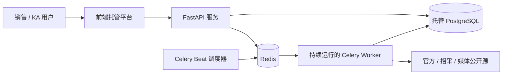

# 施耐德电气海外销售情报工作台

面向施耐德电气销售和 KA 团队的生产化 Web 应用。系统使用 FastAPI、PostgreSQL、Redis、Celery Worker 和独立前端；生产数据默认不包含演示资讯，所有情报都能追溯至原始链接。

## 当前交付范围

- 多用户登录、短期 Access Token、轮换 Refresh Token、Argon2 密码哈希、连续失败锁定和审计日志。
- `admin / analyst / sales / viewer` 四级权限；用户、收藏、已读、保存搜索和审核记录都存入 PostgreSQL。
- 生产数据模型与 Alembic 初始迁移；PostgreSQL `pg_trgm` 与全文 GIN 索引。
- Celery Worker + Redis 队列 + Beat 调度器；域名锁、域名限速、指数重试、连续五次失败自动暂停。
- 151 个数据源定义和五种明确运行状态：`active / pending_adapter / manual_only / blocked / disabled`。
- 10 个已联网验证、能返回有效列表条目的首批适配器。实时结果见 [适配器状态](docs/adapter-status.md)。
- 公众号只允许手动导入并固定标记 `wechat_manual / low`；普通网页也支持人工导入，默认作为低可信媒体线索。
- 前端只读取认证后的 API，不回退到静态资讯或伪造时间、数量和成功率。


## 生产架构



推荐第一版部署组合：

- 前端：OpenAI Sites、Vercel、Cloudflare 或同类平台。
- API、Worker、Scheduler：Railway、Render、Fly.io、阿里云容器服务或持续运行的容器平台。
- PostgreSQL：Supabase、Railway PostgreSQL、阿里云 RDS 等托管实例。
- Redis：Railway Redis、Upstash、阿里云 Redis 等托管实例。

前端公开并不等于数据会自动更新；Worker、Scheduler、PostgreSQL 和 Redis 必须持续在线。

## 使用 Docker Compose 启动完整栈


需要 Docker 24+ 与 Compose v2。

```powershell
Copy-Item .env.example .env
# 修改 .env 中的 POSTGRES_PASSWORD、DATABASE_URL、JWT_SECRET、ALLOWED_ORIGINS
docker compose up --build -d
docker compose run --rm api python cli.py create-admin --email admin@example.com --name 系统管理员
```

服务地址：

- 前端：`http://localhost:3000`
- API 文档：`http://localhost:8000/docs`
- 健康检查：`http://localhost:8000/health`

Compose 包含 `frontend / api / worker / scheduler / postgres / redis / migrate`。`migrate` 成功后 API、Worker 和 Scheduler 才启动。

## 本地开发

后端：

```powershell
cd backend
python -m venv .venv
.\.venv\Scripts\python.exe -m pip install -r requirements.txt
Copy-Item .env.example .env
$env:DATABASE_URL='sqlite:///./sales_intelligence.db' # 仅限本地开发
.\.venv\Scripts\alembic.exe -c alembic.ini upgrade head
.\.venv\Scripts\python.exe cli.py create-admin --email admin@example.com
.\.venv\Scripts\uvicorn.exe api:app --reload --port 8000
```

另开终端启动 Redis、Worker 和调度器：

```powershell
cd backend
.\.venv\Scripts\celery.exe -A celery_app.celery worker --loglevel=INFO --concurrency=4
.\.venv\Scripts\celery.exe -A celery_app.celery beat --loglevel=INFO
```

前端：

```powershell
Copy-Item .env.example .env.local
npm.cmd install
npm.cmd run dev
```

## 数据库与迁移

生产环境必须执行 Alembic，不使用 `create_all` 代替版本迁移：

```powershell
cd backend
.\.venv\Scripts\alembic.exe -c alembic.ini upgrade head
```

初始化不会创建演示资讯。来源配置由 `public/sources.yaml` 同步到数据库；管理员在页面修改的启用状态和抓取周期会保留。

## 认证与权限

- `admin`：用户管理、来源启停、周期设置、单源抓取。
- `analyst`：审核资讯、手动导入、查看抓取运行记录。
- `sales`：查看、收藏、已读、保存搜索。
- `viewer`：只读访问。

首个管理员只能通过安全的命令行创建，仓库没有默认账号或默认密码：

```powershell
python backend/cli.py create-admin --email admin@example.com --name 系统管理员
```

密码至少 12 个字符。生产环境 `JWT_SECRET` 必须至少 32 个字符，且不得提交到 Git。

## 数据源与采集状态

`public/sources.yaml` 是 JSON 兼容 YAML。每条来源包含：`source_name / source_url / source_type / region_focus / country_focus / industry_focus / crawl_method / reliability_level / enabled / notes`。

运行状态含义：

- `active`：已实现并验证的适配器，可由 Scheduler 自动调度。
- `pending_adapter`：有来源定义，但尚无可用解析器或端点待修复。
- `manual_only`：公众号或人工网页来源，永不自动抓取。
- `blocked`：robots、订阅、授权或合规条件不允许自动抓取。
- `disabled`：配置明确停用。
- `paused`：连续失败达到阈值，被系统自动暂停，需管理员核查后恢复。

适配器统一实现 `fetch_list / fetch_detail / normalize / validate / get_next_page / health_check`。再次运行联网检查：

```powershell
cd backend
$env:CRAWL_TIMEOUT_SECONDS='12'
.\.venv\Scripts\python.exe -B adapter_check.py
```

## 手动导入

分析员或管理员可在数据源管理页导入公众号/网页文章，字段包括原始链接、标题、正文、发布时间和来源名称。

- 公众号必须选择已有 `wechat_manual` 来源。
- 普通网页可填写来源名称；新来源会以 `media / low / manual_import` 建立。
- 未获官方来源支撑时，详情页显示“媒体线索，建议核验官方公告”。

## Railway + 托管数据库部署

完整的 Railway 网页配置、环境变量、迁移、管理员初始化、前端接入、验证和排障步骤见 [RAILWAY_DEPLOYMENT.md](RAILWAY_DEPLOYMENT.md)。

在同一仓库创建三个后端服务，均使用 `backend/Dockerfile`：

1. API：启动命令 `uvicorn api:app --host 0.0.0.0 --port $PORT --proxy-headers`；部署前执行 `alembic -c alembic.ini upgrade head`。
2. Worker：`celery -A celery_app.celery worker --loglevel=INFO --concurrency=4`。
3. Scheduler：`celery -A celery_app.celery beat --loglevel=INFO`，只运行一个副本。

三个服务共享 `DATABASE_URL / REDIS_URL / JWT_SECRET / CRAWL_*`。API 另配 `ALLOWED_ORIGINS=https://你的前端域名`。前端构建时设置 `NEXT_PUBLIC_API_BASE_URL=https://你的-api-域名`。

Supabase 连接串通常需要 TLS，可使用 `postgresql+psycopg://...?...sslmode=require`；连接数较小时优先使用其 Pooler。阿里云 RDS 应启用 TLS、白名单、自动备份和独立最小权限账号。

## 测试

```powershell
npm.cmd test
cd backend
.\.venv\Scripts\python.exe -m pytest -q
```

当前测试覆盖前端生产构建/SSR、静态数据回退禁用、登录/刷新/锁定、角色权限、审计、来源状态、手动导入、RSS 标准化、海外与 KA 规则以及空库 Alembic 升级。

## 关键环境变量

完整模板见 `.env.example` 与 `backend/.env.example`。生产必填：

- `DATABASE_URL`
- `REDIS_URL`
- `JWT_SECRET`
- `ALLOWED_ORIGINS`
- `NEXT_PUBLIC_API_BASE_URL`（前端构建变量）
- `CRAWL_USER_AGENT`（包含合规联系邮箱）

`OPENAI_API_KEY` 可选。未配置时只运行可解释的规则摘要，不会伪造模型结果或原文外事实。
